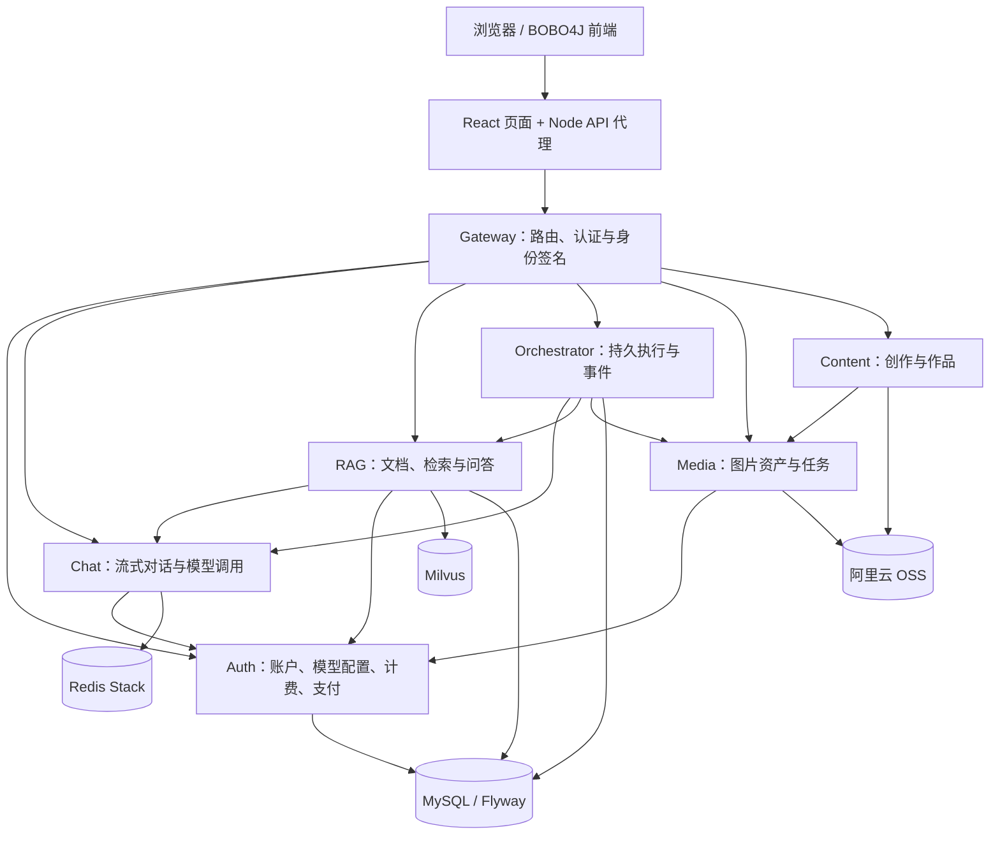

# BOBO4J

**基于 Java 与 Spring AI 的 AI 应用平台：流式对话、文档 RAG、可恢复 Agent、图片创作与账户计费。**

BOBO4J 将模型调用、知识检索、工具执行和消费结算拆分为明确的服务边界。用户可以上传文档获取摘要并连续追问，也可以让 Agent 完成多步骤任务，在中途停止、断线后重连，并查看执行进度与引用来源。

本仓库提供后端与基础设施配置；[AgentWebDemo](https://github.com/bbb-520/AgentWebDemo) 提供配套 React 前端。前后端整体统称 **BOBO4J**，源码目录和 Maven 模块名保留现有命名。

## 核心能力

| 能力 | 实现内容 |
| --- | --- |
| 对话与识图 | WebFlux SSE 流式输出、会话记忆、图片附件、用户与租户身份隔离 |
| 文档 RAG | Tika 多格式解析、语义切片、向量索引、Dense + BM25 混合召回、RRF 融合与重排序 |
| 文档摘要与追问 | 异步入库与摘要、进度查询、固定文档版本的问答会话、可查看的原文引用 |
| Agent 执行 | 模型输出决策，外循环调用白名单工具；动态轮次预算、工具超时、步骤幂等、执行审计 |
| 停止与恢复 | 持久化任务和事件，显式停止、版本控制的继续执行、SSE 游标回放 |
| 模型兜底 | 主模型超时或异常时最多尝试一次备用模型；失败时给出明确状态，保留已有内容与调用回执 |
| 图片与内容 | OSS 上传策略、图片生成任务、Zine 创作与 Bobo World 作品发布 |
| 账户与支付 | QQ 邮箱验证码、Cookie 登录、免费 Token、钱包与消费记录、支付宝及微信扫码充值 |
| 可观测性 | Actuator、Micrometer、Prometheus 指标与告警，Zipkin 调用链 |

## 技术栈

版本以 [Maven 父模块](platform-parent/pom.xml)、[RAG 模块](agent-rag-service/pom.xml)和 Compose 中的配置为准。

| 层次 | 技术 |
| --- | --- |
| 后端 | Java 21、Spring Boot 4.1.1、Spring AI 2.0.1、Spring WebFlux / Reactor |
| 微服务 | Spring Cloud 2025.1.0、Spring Cloud Alibaba 2025.1.0.0、Gateway、Nacos 3.1.1、Sentinel |
| 数据与迁移 | MySQL 8.4、Spring JDBC、MyBatis、Flyway、Redis Stack 7.4 |
| 文档与检索 | Apache Tika 3.3.2、Milvus Server 2.6.2 / Java SDK 2.6.4、BM25、RRF |
| 模型 | DashScope / Qwen 与 OpenAI 兼容接口；默认 Embedding 为 `text-embedding-v4`，向量维度 1024 |
| 对象存储与支付 | 阿里云 OSS SDK、JavaMail、支付宝 SDK、微信 Native API v3 |
| 前端 | React 18、TypeScript 5.6、Vite 5、Node.js 22、Three.js / React Three Fiber |
| 部署与监控 | Docker / Compose、Prometheus 3.4.2、Zipkin 3.5.1 |
| 验证 | JUnit 5、Spring Boot Test、Testcontainers、H2、前端 Node 测试、架构契约检查 |

## 项目架构



Nacos 为运行服务提供注册发现与配置管理；Prometheus 抓取服务指标，Zipkin 收集调用链。业务入口统一经过 Gateway，`/internal/**` 仅用于带签名身份的服务间调用。

### 服务与模块

| 服务 | 默认端口 | 职责 |
| --- | ---: | --- |
| `agent-gateway` | 18000 | API 路由、登录态校验、可信身份签名、CORS |
| `agent-auth-service` | 18081 | 用户、邮箱验证码、平台模型、钱包、支付与对账 |
| `agent-media-service` | 18082 | 图片上传资产、OSS、生成任务与供应商回执 |
| `agent-content-service` | 18083 | Zine 创作与 Bobo World 发布 |
| `agent-orchestrator-service` | 18084 | 执行状态、动态预算、步骤、停止、继续和事件回放 |
| `agent-chat-service` | 18085 | 流式聊天、识图、模型兜底与会话记忆 |
| `agent-rag-service` | 18086 | 文档解析、摘要、混合检索、问答和来源验证 |

```text
浏览器 → agent-web:5173 → agent-gateway:18000
                            ├─ agent-auth-service:18081
                            ├─ agent-media-service:18082
                            ├─ agent-content-service:18083
                            ├─ agent-orchestrator-service:18084
                            ├─ agent-chat-service:18085
                            └─ agent-rag-service:18086
```

```text
BOBO4J/
├─ platform-parent/              # 依赖与版本管理
├─ agent-api/                    # 跨服务 DTO 和接口契约
├─ agent-common/                 # 签名身份、通用安全及观测能力
├─ agent-runtime/                # 运行时公共能力、身份和对象存储
├─ agent-gateway/
├─ agent-auth-service/
├─ agent-chat-service/
├─ agent-rag-service/
│  └─ evaluation/                # 评测语料、采集及校准脚本
├─ agent-orchestrator-service/
├─ agent-media-service/
├─ agent-content-service/
├─ agent-architecture-tests/     # 端口、路由、模块和迁移契约
├─ infra/                       # Nacos、MySQL、Redis、Milvus、监控
├─ scripts/                     # 构建、配置导入及检查脚本
├─ docker-compose.app.yml
├─ Dockerfile.service
└─ .env.example                 # 无真实凭据的配置模板
```

### RAG 工作链路

1. 用户以幂等请求 ID 上传文档，原件落到文档存储卷，入库任务异步执行。
2. Tika 提取文本，按内容边界切片，保留文档版本、标题、段落与原文范围；执行语义切分和 Embedding。
3. 向量写入 Milvus，文档与切片元数据保存在 MySQL；摘要分段生成并汇总，提供状态与覆盖率。
4. 问答会话固定选中文档及索引版本。多轮追问根据已提交的历史改写检索问题。
5. Milvus Dense 召回与应用层 BM25 召回通过 RRF 融合，再使用 Rerank 筛选证据。
6. 模型基于证据作答；`RelevancyEvaluator`、事实支持和引用检查共同约束结果，无充分证据时明确说明。

默认重排序模型为 `qwen3-rerank`，评估及备用模型为 `qwen-plus`。模型由运营者配置，名称不代表已配置凭据或供应商一定可用。更换 Embedding 模型时需要维护一致的维度并重新建立索引。

当前支持带文本层的 PDF、Office、HTML、Markdown 和纯文本，单文件上限 100 MiB；不包含扫描件 OCR。离线评测包含 12 个文档族、48 个问题，用于区分召回缺失、排序不佳与回答不忠实；语料验证通过不等于真实模型质量达标。

### Agent、流式恢复与兜底

执行预算初始为 4 轮，有有效进展时按 4 轮扩展；仍受 64 轮、128 次工具调用、64,000 Token 和 30 分钟活动时间的硬上限约束。无进展或预算不足时进入等待状态，由用户补充信息或继续执行。恢复不会清零累计消耗。

任务、工具步骤和事件写入 MySQL。步骤使用稳定调用 ID 和回执恢复，避免刷新、重连或重启造成重复派发。停止 SSE 订阅只断开连接；停止持久任务必须调用 `/stop`。执行事件 ID 为 `executionId:seq`，通过 `Last-Event-ID` 或 `after` 回放遗漏事件。

主模型默认首段超时 15 秒、空闲超时 20 秒、总超时 60 秒；备用调用默认 30 秒。兜底保留任务约束和文档证据，不能把失败状态包装成成功。已派发但消费未知的调用进入待对账状态，不承诺供应商撤销或免费重复调用。

## API 调用

API 基址为 Gateway 的 `/api`，前端 Node 服务也代理同路径。普通接口返回 JSON，对话和执行事件返回 `text/event-stream`。接口定义见各模块控制器及 [agent-api](agent-api/src/main/java/com/bbb/exercise/agentdemo/api)。

### 主要接口

| 方法 | 路径 | 用途 |
| --- | --- | --- |
| POST | `/api/auth/email/code` | 发送 QQ 邮箱验证码，`purpose` 为 REGISTER / LOGIN / BIND |
| POST | `/api/auth/register` | 注册，提交用户名、密码、QQ 邮箱和验证码 |
| POST | `/api/auth/login`、`/api/auth/email/login` | 密码登录或邮箱验证码登录 |
| GET / POST | `/api/auth/me` / `/api/auth/logout` | 当前账户 / 登出 |
| GET | `/api/settings/models` | 可用的平台模型配置 |
| POST | `/api/chat` | 对话 SSE，字段为 `question`、`sessionId`、`attachments` |
| POST / GET | `/api/documents` | 上传文档 / 文档列表 |
| GET | `/api/documents/{id}`、`/api/documents/{id}/summary` | 入库状态 / 摘要 |
| POST | `/api/documents/{id}/retry` | 重试失败的文档任务 |
| POST | `/api/document-conversations` | 以 `documentIds` 创建文档问答会话 |
| GET | `/api/document-conversations/{id}` | 固定索引版本与已提交问答历史 |
| GET | `/api/documents/{id}/sources/{chunkId}` | 查看拥有权限的原文切片 |
| POST | `/api/agent-executions` | 创建 CHAT / AGENT / DOCUMENT_QA 持久任务 |
| GET | `/api/agent-executions/{id}` | 查询任务状态、答案、预算与版本 |
| GET | `/api/agent-executions/{id}/events` | 带事件 ID 的 SSE 订阅与回放 |
| POST | `/api/agent-executions/{id}/stop`、`/api/agent-executions/{id}/resume` | 停止 / 继续任务 |
| POST | `/api/image-assets/upload-policy` | 获取受限的 OSS 图片上传策略 |
| POST | `/api/image-jobs`、`/api/zine/generate` | 图片生成任务 / Zine 创作 |
| GET / POST | `/api/bobo/world` / `/api/bobo/items` | 作品浏览 / 发布 |
| GET | `/api/billing/wallet`、`/api/billing/usage` | 钱包 / 消费明细 |
| POST / GET | `/api/payments/orders` / `/api/payments/orders/{id}` | 创建扫码充值订单 / 查询状态 |

登录成功写入 HttpOnly Cookie；浏览器请求使用 `credentials: 'include'`。用户和租户身份由服务端解析，客户端不能通过自填身份头指定其他用户。

### 登录与流式对话

以下 curl 示例使用已注册账户，`bobo4j.cookies` 仅保存在本地。首次注册须先获取 REGISTER 用途的邮箱验证码。

```bash
curl -c bobo4j.cookies -H 'Content-Type: application/json' \
  -d '{"username":"demo","password":"YOUR_PASSWORD"}' \
  http://localhost:18000/api/auth/login

curl -N -b bobo4j.cookies -H 'Content-Type: application/json' \
  -d '{"question":"请介绍你能完成的任务","sessionId":"demo-chat"}' \
  http://localhost:18000/api/chat
```

### 文档上传与二次提问

```bash
curl -b bobo4j.cookies -H 'X-Request-ID: upload-demo-001' \
  -F 'file=@guide.pdf' http://localhost:18000/api/documents

# 将 DOCUMENT_ID 替换为上传返回的 documentId；等待入库状态就绪。
curl -b bobo4j.cookies http://localhost:18000/api/documents/DOCUMENT_ID
curl -b bobo4j.cookies http://localhost:18000/api/documents/DOCUMENT_ID/summary

curl -b bobo4j.cookies -H 'Content-Type: application/json' \
  -d '{"documentIds":["DOCUMENT_ID"]}' \
  http://localhost:18000/api/document-conversations

# DOCUMENT_CONVERSATION_ID 来自上一步；再次提问保持同一文档会话，换新的 requestId。
curl -b bobo4j.cookies -H 'Content-Type: application/json' \
  -d '{"requestId":"qa-demo-001","type":"DOCUMENT_QA","question":"文档主要结论是什么？","documentConversationId":"DOCUMENT_CONVERSATION_ID"}' \
  http://localhost:18000/api/agent-executions
```

文档上传返回 202，表示接收任务，不表示已经完成索引或摘要。回答通过执行接口的状态和事件获取；公开接口不直接暴露 `/internal/rag/answer`。

### 事件回放、停止与继续

```bash
curl -N -b bobo4j.cookies \
  http://localhost:18000/api/agent-executions/EXECUTION_ID/events

# LAST_SEQ 使用已确认收到的事件序号；Last-Event-ID 的格式为 EXECUTION_ID:LAST_SEQ。
curl -N -b bobo4j.cookies -H 'Last-Event-ID: EXECUTION_ID:LAST_SEQ' \
  http://localhost:18000/api/agent-executions/EXECUTION_ID/events

curl -X POST -b bobo4j.cookies \
  http://localhost:18000/api/agent-executions/EXECUTION_ID/stop

# 将示例版本 7 替换为最新任务查询中的 version；按实际等待/停止状态决定是否可继续。
curl -b bobo4j.cookies -H 'Content-Type: application/json' \
  -d '{"requestId":"resume-demo-001","expectedVersion":7,"additionalRounds":4,"instruction":"继续完成分析"}' \
  http://localhost:18000/api/agent-executions/EXECUTION_ID/resume
```

执行创建的 `requestId` 是幂等键；相同键与相同参数返回同一任务，键相同而参数不一致返回冲突。恢复的 `expectedVersion` 用于防止并发覆盖。

### 充值订单与错误语义

```bash
curl -b bobo4j.cookies -H 'Content-Type: application/json' \
  -H 'Idempotency-Key: recharge-demo-001' \
  -d '{"channel":"ALIPAY","amountCents":100}' \
  http://localhost:18000/api/payments/orders
```

支付渠道为 `ALIPAY` 或 `WECHAT`，金额使用整数分；渠道须由运营者配置启用。订单提供二维码内容，钱包只在服务端验证支付通知后入账，不能以页面跳转或客户端状态判断支付成功。

| 状态 | 常见含义 |
| --- | --- |
| 401 / 403 | 未登录或无权访问资源 |
| 402 | 欠费或可用消费额度不足 |
| 409 | 幂等参数冲突、版本冲突、并发调用或消费待对账 |
| 413 | 上传超过大小限制 |
| 502 / 503 | 上游服务失败或能力尚未配置 |

SSE 已开始后，还需检查流内错误事件与最终任务状态，不能只看 HTTP 200。

## 计费与数据一致性

新注册账户一次性获得 1,000,000 免费 Token；按真实输入、输出 Token 消耗结算，优先扣免费额度，历史账户不自动补发。剩余不超过 100,000 Token 时提醒；欠费状态阻止继续调用。没有 Token 用量的图片按图片规则结算。

内部金额使用整数微元，1 元 = 1,000,000 微元。预授权、派发、供应商回执、结算与退款通过事务和幂等约束关联；未知消费保留占用并等待对账。站内消费退款不等于支付渠道原路退款。

MySQL 各服务使用独立 Flyway history；Redis 保存对话记忆，Milvus 保存文档向量，文档原件和基础设施数据使用独立持久卷。

## 开发与验证

后端需要 JDK 21 和 Maven；前端需要 Node.js 22。完整启动和 OSS、SMTP、支付配置步骤保存在本地 `HELP.md`，该运维文档不随 GitHub 仓库提交。公开配置模板见 [.env.example](.env.example)。

```bash
# 后端完整构建与验证
mvn -Dmaven.compiler.fork=true verify

# 架构契约：README 端口、模块默认端口、路由与配置一致性
mvn -pl agent-architecture-tests -am -Dmaven.compiler.fork=true test

# 前端仓库
npm ci
npm run typecheck
npm run build
npm run test:accounts-billing
npm run test:executions
npm run test:documents
npm run test:proxy-cancellation
```

容器基础设施测试需要 Docker，且按测试的环境开关启用。文档评测入口为 [agent-rag-service/evaluation](agent-rag-service/evaluation)，真实采集会调用模型；结论须区分语料检查、自动评估和人工标注。

## 项目边界

- 默认部署是单机多容器方案，不能据此声称已具备高可用、集群灾备或无限任务执行能力。
- 模型、OSS、邮箱和支付需要各自凭据，启动就绪不等于外部能力已验证。
- 文档证据检查与模型兜底减少失败和不忠实回答，无法保证每次生成绝对正确。
- README 描述当前源码实现；生产环境应使用一致版本的前后端，并在改动后重新打包和构建镜像。
